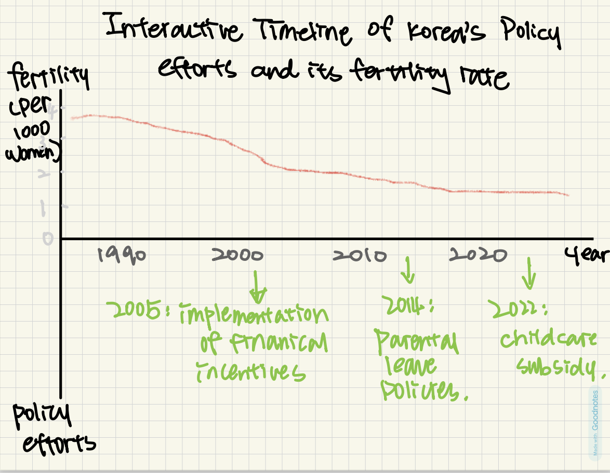

| [home page](https://ag035.github.io/amyguan-dataviz-portfolio/) | [data viz examples](Examples) | [critique by design](critique-by-design) | [final project I](final-project-part-one) | [final project II](final-project-part-two) | [final project III](final-project-part-three) |

# Portfolio
This is my public portfolio for Telling Stories with Data at CMU!  
### Web page URL: 
https://ag035.github.io/amyguan-dataviz-portfolio/
### This repository: 
https://github.com/ag035/amyguan-dataviz-portfolio

# About me
Hi! I’m **Amy Guan**. I was born and raised in _Ningbo_, a vibrant city on the east coast of China. At 16, I moved to the other side of the world - _Ottawa_ - for high school and began my journey as an international student and traveler.

In college (_Bryn Mawr College, PA_), I developed an interest in comparative politics and international affairs. This brought me to _Carnegie Mellon University_, where I’m pursuing a **Master’s in Public Policy and Management**. My focus is on equitable social policies, such as housing and health. My past research includes racial exclusion laws and policies affecting the AAPI community, and their repealing process.

Outside my program, I enjoy cooking, learning the ukulele, and watching thriller series.

# What I hope to learn
I'm taking _Telling Stories with Data_ because I believe data visualization and story telling are just as important as data processing itself. Below are some **specific skills I hope to develop**:

1. Learning to use tools like Tableau and Excel to prepare and visualize data effectively
2. Understanding how design elements could help conveying clearer messages from data
3. Developing the ability to identify narratives in news or articles that use data to tell stories

Additionally, **my goals include**:
1. Building a presentable portfolio for future job searches
2. Using the skills acquired from this class to bridge the gap between people and data, making information more accessible to non-technical audiences

# Portfolio

## In-Class Dataviz 1: Urban Mobility Readiness 

## Examples
### Practice: Government Debt

<noscript></noscript><object class='tableauViz'  style='display:none;'><param name='host_url' value='https%3A%2F%2Fpublic.tableau.com%2F' /> <param name='embed_code_version' value='3' /> <param name='site_root' value='' /><param name='name' value='Book1-GovDebt&#47;HistoricalGeneralGovernmentDebtbyCountry' /><param name='tabs' value='no' /><param name='toolbar' value='yes' /><param name='static_image' value='https:&#47;&#47;public.tableau.com&#47;static&#47;images&#47;Bo&#47;Book1-GovDebt&#47;HistoricalGeneralGovernmentDebtbyCountry&#47;1.png' /> <param name='animate_transition' value='yes' /><param name='display_static_image' value='yes' /><param name='display_spinner' value='yes' /><param name='display_overlay' value='yes' /><param name='display_count' value='yes' /><param name='language' value='en-US' /><param name='filter' value='publish=yes' /></object>
  

## Assignment: [Visualizing overnment Debt](visualizing-government-debt)

<noscript></noscript><object class='tableauViz'  style='display:none;'><param name='host_url' value='https%3A%2F%2Fpublic.tableau.com%2F' /> <param name='embed_code_version' value='3' /> <param name='site_root' value='' /><param name='name' value='GovernmentDebtPost2008&#47;GovernmentDebtPost2008' /><param name='tabs' value='no' /><param name='toolbar' value='yes' /><param name='static_image' value='https:&#47;&#47;public.tableau.com&#47;static&#47;images&#47;Go&#47;GovernmentDebtPost2008&#47;GovernmentDebtPost2008&#47;1.png' /> <param name='animate_transition' value='yes' /><param name='display_static_image' value='yes' /><param name='display_spinner' value='yes' /><param name='display_overlay' value='yes' /><param name='display_count' value='yes' /><param name='language' value='en-US' /></object>
                

## Assignment 3&4: [Critique by Design](critique-by-design)
For this assignment, make sure you set up and link to a new page.  This page is linking to a new Markdown document called `critique-by-design.md`.  

## Final project
Here it might be helpful to include a high-level description of your final project. 
## Part I
[Part I](final-project-part-one)

### Summary
**Korea's pronatalist policies: a failing formula? Lessons from Sweden**
South Korea faces a severe demographic challenge, with its fertility rate dropping to the lowest in the world despite extensive government policy efforts. Pronatalist policies, including parental leave, childcare subsidies, and financial incentives, have not reversed the numbers. This project explores South Korean's efforts, their effectiveness, and policy solutions based on Sweden's successful model. 

### Outline
**1. Introduction**

_Fun fact_: South Korea had more pet strollers sold than baby strollers. (picture)

Overview of Korea's declining fertility rate. 

Introduce Sweden as a counterexample: once faced a similar issue, how did they reverse the trend. 

**2. DataViz: Korea's declining birth rate**

_idea 1_: korea's fertility rate dropping

_idea 2_: interactive timeline of Korea's policy efforts vs. birth rate trends

_idea 3_: comparative of Korea and Sweden fertility rate

**3. What has Korea tried**

side by side comparison of policy and their actual impact on fertility 

examples: maternity and parental leave policies, financial incentives and subsidies

**4. What Sweden did differently**

organize by factor 

_factor 1_: equal parental leave policies (dataset found: parental leave for fathers)

_factor 2_: higher representation of women in government and workplace leadership (dataset found: Proportion of seats held by women in national parliaments (%))

_factor 3_: possibilities of losing job or professional opportunities due to pregnancy 

**5. The missing pieces in Korea's approach (key takeaways)**

**6. Implications**

I'm not urging for higher fertility rate through this project as an end goal - women should have full autonomy over their reproductive choices. However, a persistently low birth rate can serve as a signal that systemic barriers, such as workplace policies, gender norms, and childcare access, made parenthood an unattractive option for many. If more women feel empowered, supported, and able to handle career and family without significant personal or financial strain, a higher fertility rate may naturally follow as an indicator of improved conditions rather than an objective itself. 

**7. Call to action**

_Poll_: what do you think is the biggest barrier to having more children in korea? 

policy recommendations. 

### Sketches

### Data

### Delivery

## Part II
[Part II](final-project-part-two)

## Part III
Part III(final-project-part-three)

---
## Other stuff you can do (you can remove this section - it's just for your reference.)

### Changing text

You can change text, like this: 

**Here's some bold** text.  Here's some *italic* text. Here's some ~~strikethrough~~ text. 

### Creating tables

You can build tables like this: 

| Name         | Type of pet | Favority activity 1 | FA 2   | FA 3            | FA 4                                |
|--------------|-------------|---------------------|--------|-----------------|-------------------------------------|
| Eli          | cat         | Sleeping            | Eating | Being pet       | Plotting to overthow dog empire     |
| Howard       | dog         | You                 | You    | You             | Eating                              |
| Frankenstein | fish        | Swimming            | Eating | Blowing bubbles | Forgetting                          |

An easy-to-use template generator tool [can be found here](https://www.tablesgenerator.com/markdown_tables)

You can use different headings, like this: 

# Here's a large title (H1)
## Here's a subtitle (H2)
### ...and so on (H3)
You get the idea - just don't forget the space between the # and your title.  `#Title` won't work, but `# Title` will. 

### Adding images

Here's an example of how to add an image to my portfolio.  

> Photo by <a href="https://unsplash.com/pt-br/@charlesdeluvio?utm_source=unsplash&utm_medium=referral&utm_content=creditCopyText">charlesdeluvio</a> on <a href="https://unsplash.com/photos/K4mSJ7kc0As?utm_source=unsplash&utm_medium=referral&utm_content=creditCopyText">Unsplash</a>
  

Alternately, you can set the size of the image using just a bit of HTML: 

Remember that you'll need to upload the image into your repository, or include a link to the image somewhere else.  

### Setting up a separate page

So here's the code you'll need to add to your own site to create a second page. 

1. First, create a new page in your repository (for example, dataviz1.md)
2. Next, add a link to that page by inserting the following into your readme.md page:

`[title](dataviz)` or `[dataviz](https://cmustudent.github.io/portfolio/dataviz.html)` or `[CMU](https://www.cmu.edu)`

Any of those formats will work. Here's some examples of working links: 

`[title](dataviz)` = [title](dataviz)  
`[dataviz](https://cmustudent.github.io/portfolio/dataviz.html)` = [dataviz](https://cmustudent.github.io/portfolio/dataviz.html)  
`[CMU](https://www.cmu.edu)` = [CMU](https://www.cmu.edu)   

Make sure to check these from your publicly accessible URL to make sure they're working correctly (not from the preview tab). 

Looking for more?  A nice Markdown guide [can be found here](https://www.markdownguide.org/cheat-sheet/)

## References
_List any references you used here._

## AI acknowledgements
_If you used AI to help you complete this assignment (within the parameters of the instruction and course guidelines), detail your use of AI for this assignment here._
1. I used ChatGPT to resize the image of In-class Dataviz #1. 

