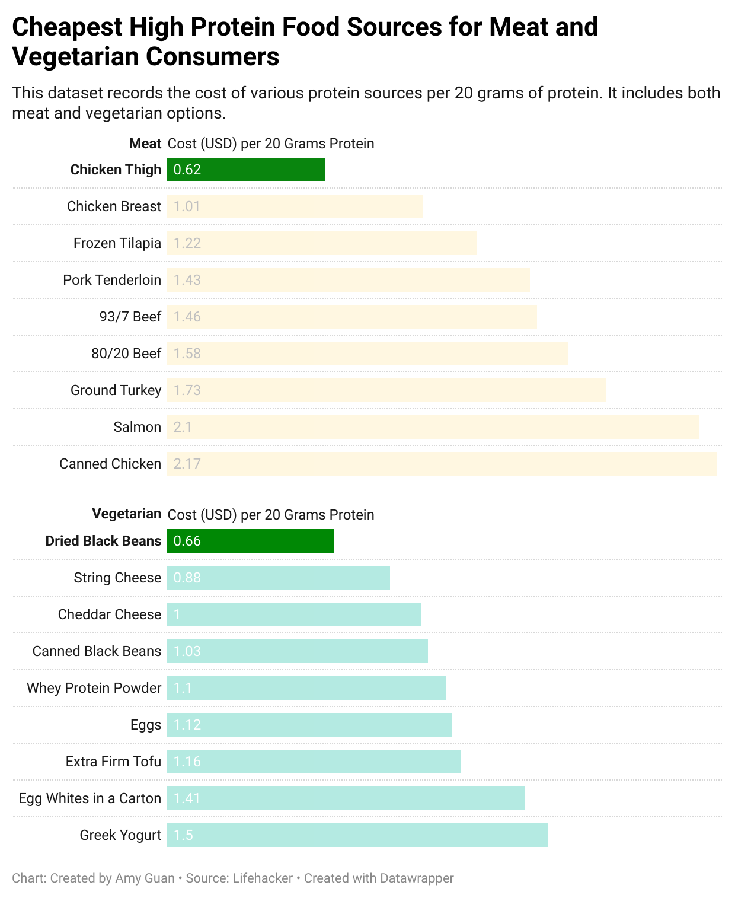

| [home page](https://cmustudent.github.io/tswd-portfolio-templates/) | [data viz examples](dataviz-examples) | [critique by design](critique-by-design) | [final project I](final-project-part-one) | [final project II](final-project-part-two) | [final project III](final-project-part-three) |

# Makeover Monday Design Critique and Redesign

## Step one: the visualization

**The Cheapeast Ways to Get Your Protein**

**Data Source**: https://lifehacker.com/the-cheapest-ways-to-get-your-protein-right-now

**Data Vis**: https://www.thebodybuildingdietitians.com/blog/how-cost-effective-is-your-high-protein-diet

## Step two: the critique

### **Comments on Original Data Viz**

🏆*What worked well:*

1. **The images：** The addition of pictures to the bar chart makes it easy to look at and also a bit playful. They match with the labels on the x axis.
2. **The ranking：** There is a clear downward ranking of which protein is the most costly and which is the least, making it helpful to targeted audiences.  
3. **Inclusion of both vegetarian and meat options:** The graph includes information from both meat and vegetarian protein sources, making it more accessible. However, it would be more accessible if one graph could contain separated information for meat and vegetarian for clarity and further accessibility.

⛽️*What needs improvement:*

1. **Y-axis is difficult to read and interpret:** Firstly, the text is vertical instead of horizontal, I had to tilt my head to read it. Secondly, 30 grams is not a common unit to understand, making it 100 grams would be more understandable. Moreover, to make it more accessible, it should include a equivalent American unit like pound. 
2. **Confusing annotation:** While the height of the bar should represent the cost of that protein, it labels calories for that food. It causes two confusions. One, the audience would need a couple of seconds to process that information, and would not be able to know the accurate cost for each protein. Two, the unit of the calories remains unclear. Is it 200cal per 30 grams for Quorn? Not specified. 
3. **Lack of color use:** All bars are blue, and there is no elements that stand out. Moreover, blue is not the color that is usually associated with food, making it unattractive to look at. Unclear what the story is here.

### **Audience Analysis**

The primary audience might be those who value their dietary intake or those who are in a fitness training process who want to evaluate the cost of their protein source. This visualization is effective in terms of providing alternative protein sources, as it displays various sources with different price ranges. However, it is not effective in terms of the unit it uses - 30 gram - price per 30 gram might make sense to only minor part of the audience. Moreover, it does not separate meat and vegetarain options, making it diverse for meat consumers but not as accessible for vegetarians. 

### **Method Evaluation**

This evaluation method provides a conclusive audience perception of the visualization. It articulates aspects that an audience observes within 10 seconds of looking at the visualization, making it a strong evaluation method. It includes more element than the good chart matrix, however, the matrix is more straightforward visually, and consider more visual elements than this method. I would recommend to add some other elements to evaluate in this method. Accessibility - how accessible it is consider its diverse audiences. Color use - how much it utilized color to bring a focus to the viz. 
   
## Step three: Sketch a solution

## Step four: Test the solution

### Questions List:

1. Can you tell me what you think this is? 

2. What are the elements that you immediately notice? 

3. Is there anything you find surprising or confusing?

4. Who do you think is the intended audience for this?

5. Is there anything you would change or do differently?

### Results: 

*Interviewee 1:* MEAM student with no data viz background
*Interviewee 2:* MSPPM-DC student with previous experience with data viz

| Question |                     Interview 1                               |                                   Interview 2                                  |
|----------|---------------------------------------------------------------|--------------------------------------------------------------------------------|
|     1    | A graph explaining meat and vegeterain protein source options | A graph explaining the cost of different protein sources by meat and vegeterian options|
|     2    | - Chicken breast and tofu are the most affordable protein sources   - The unit is price per 30 grams| - Longer the bar the more expensive it is   - There are more meat options than vegetarian options, might indicate that meat is a more accessible lifestyle                        |
|     3    | The two sided bar is helpful and accessible                        |More annotation is needed for interpretation                          |
|4| Someone who wants to convert from meat to vegeterian diets; people who want to convert for economic reasons | Supermarket, to target their consumers|
|5| Marking the best option and offer criteria of judging what is defined the best |Reverse the order of the bars, label the axises clearer|

### Synthesis: 

*Interviewees noticed the emphasis the option for both the meat and vegeterian consumers.* It makes the chart more accessible, but I also need to ensure that the focus on the price/cost needs to stand out as the main theme of the chart. 

*More elements are needed on explaining the story.* For example, labeling and numerical values. 

*Improve Viz.* Reversing the order and coloring the bar would make it a clearer and more intuitive story. 

## Step five: build the solution

I used datawrapper for my final redesign of the visualization. 

Considering that the audience of the viz could be consumers who focus on their protein intake and nutritient balance, I categorized meat and vegetarian options. Considering feed back from interviewees, this would also benefit people who are considering shifting diet for economic reasons. 

I picked color yellow to represent meat options, and color green to represent vegetarian options. On top of that, I ordered the bars by descending order, to showcase the cheapest to most expensive protein source ranking. I highlighted the cheapest meat and vegetarian sources, which are chicken thigh and dried black beans, so that they would stand out to audience. 

My interviewees reflected that they would benefit from more labels to understand the chart better, which is why I incorporated all numerical costs in the viz. They are aligned, so that it does not look disturbing. I also redesigned the layout. My previous layout makes it confusing to read and compare meat and vegetarian options, which is why I put them in two separate subcharts so that audience can navigate to their choice of diet. 

## References

https://www.thebodybuildingdietitians.com/blog/how-cost-effective-is-your-high-protein-diet

https://lifehacker.com/the-cheapest-ways-to-get-your-protein-right-now

## AI acknowledgements

