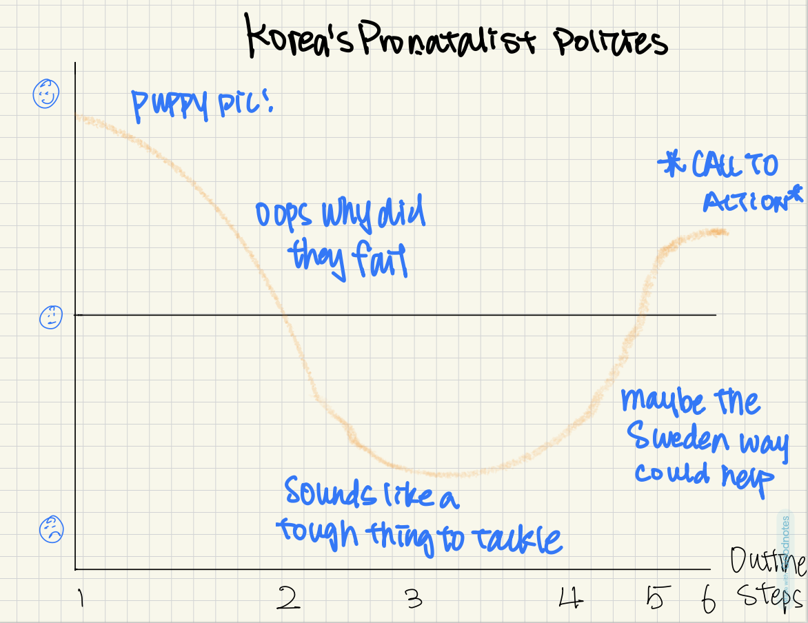
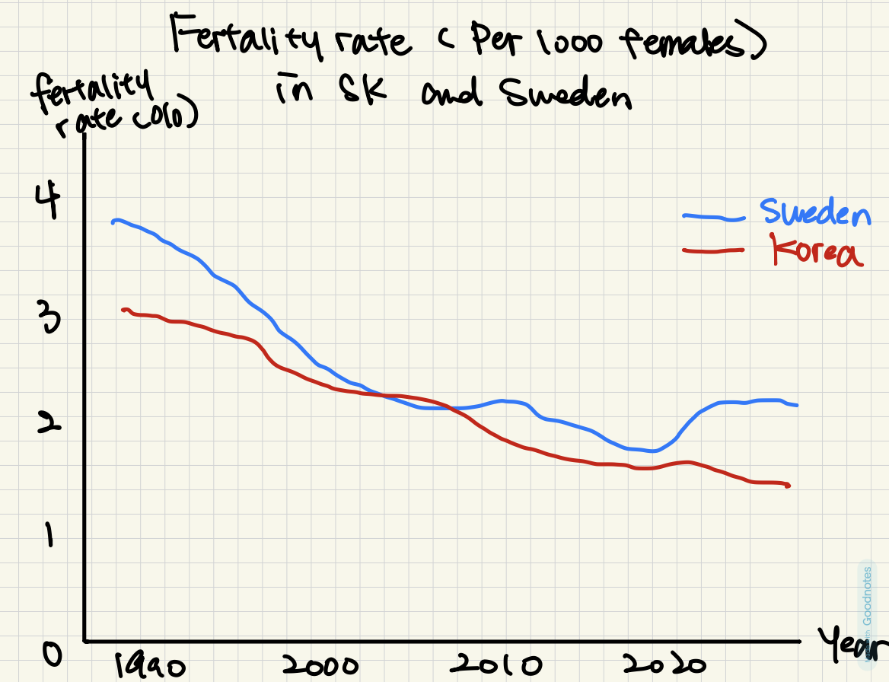

| [home page](https://cmustudent.github.io/tswd-portfolio-templates/) | [data viz examples](dataviz-examples) | [critique by design](critique-by-design) | [final project I](final-project-part-one) | [final project II](final-project-part-two) | [final project III](final-project-part-three) |

## Final project
Here it might be helpful to include a high-level description of your final project. 
## Part I
[Part I](final-project-part-one)

### Summary
**Korea's pronatalist policies: a failing formula? Lessons from Sweden**
South Korea faces a severe demographic challenge, with its fertility rate dropping to the lowest in the world despite extensive government policy efforts. Pronatalist policies, including parental leave, childcare subsidies, and financial incentives, have not reversed the numbers. This project explores South Korean's efforts, their effectiveness, and policy solutions based on Sweden's successful model. 

### Outline
**1. Introduction**

_Fun fact_: South Korea had more pet strollers sold than baby strollers. (picture)

Overview of Korea's declining fertility rate. 

Introduce Sweden as a counterexample: once faced a similar issue, how did they reverse the trend. 

**2. DataViz: Korea's declining birth rate**

_idea 1_: korea's fertility rate dropping

_idea 2_: interactive timeline of Korea's policy efforts vs. birth rate trends

_idea 3_: comparative of Korea and Sweden fertility rate

**3. What has Korea tried**

side by side comparison of policy and their actual impact on fertility 

examples: maternity and parental leave policies, financial incentives and subsidies

**4. What Sweden did differently**

organize by factor 

_factor 1_: equal parental leave policies (dataset found: parental leave for fathers)

_factor 2_: higher representation of women in government and workplace leadership (dataset found: Proportion of seats held by women in national parliaments (%))

_factor 3_: possibilities of losing job or professional opportunities due to pregnancy 

**5. The missing pieces in Korea's approach (key takeaways)**

**6. Implications**

I'm not urging for higher fertility rate through this project as an end goal - women should have full autonomy over their reproductive choices. However, a persistently low birth rate can serve as a signal that systemic barriers, such as workplace policies, gender norms, and childcare access, made parenthood an unattractive option for many. If more women feel empowered, supported, and able to handle career and family without significant personal or financial strain, a higher fertility rate may naturally follow as an indicator of improved conditions rather than an objective itself. 

**7. Call to action**

_Poll_: what do you think is the biggest barrier to having more children in korea? 

policy recommendations. 

### Sketches

### Data

**Approach**

The data sources for this analysis are drawn from the World Bank Gender Dta Portal, a widely recognized public accessible data source of global gender-related statistics. The data set on adolescent fertility rates (births per 1000 women aged 15-19) and total fertility rates provide a foundational approach to understand trends in childbearing in South Korea and its peer countries. 

Additionally, the length of parental leave and government's role in administering maternity leave benefits help assess the structural support provided to working parents. 

Data on the proportion of seats held by women in national parliaments and the female to male labor force participation ratio explains gender equality in political and economic spheres. 

**Current Sources**

Adolescent fertility rate (births per 1,000 women ages 15-19). (n.d.). World Bank Gender Data Portal. Retrieved February 4, 2025, from https://genderdata.worldbank.org/en/indicator/sp-ado-tfrt

Fertility rate, total (births per woman). (n.d.). World Bank Gender Data Portal. Retrieved February 4, 2025, from https://genderdata.worldbank.org/en/indicator/sp-dyn-tfrt-in

Length of parental leave (calendar days). (n.d.). World Bank Gender Data Portal. Retrieved February 4, 2025, from https://liveprod.worldbank.org/en/indicator/sh-par-leve

Proportion of seats held by women in national parliaments (%). (n.d.). World Bank Gender Data Portal. Retrieved February 4, 2025, from https://genderdata.worldbank.org/en/indicator/sg-gen-parl-zs

Ratio of female to male labor force participation rate (%). (n.d.). World Bank Gender Data Portal. Retrieved February 4, 2025, from https://genderdata.worldbank.org/en/indicator/sl-tlf-cact-fm-zs

The government administers 100 percent of maternity leave benefits (1=yes; 0=no). (n.d.). World Bank Gender Data Portal. Retrieved February 4, 2025, from https://genderdata.worldbank.org/en/indicator/sh-mmr-leve-gt

### Delivery

I might create an interactive website to present my content, which will stay accessible to broader readers after class. I'm considering using Shorthand. 
